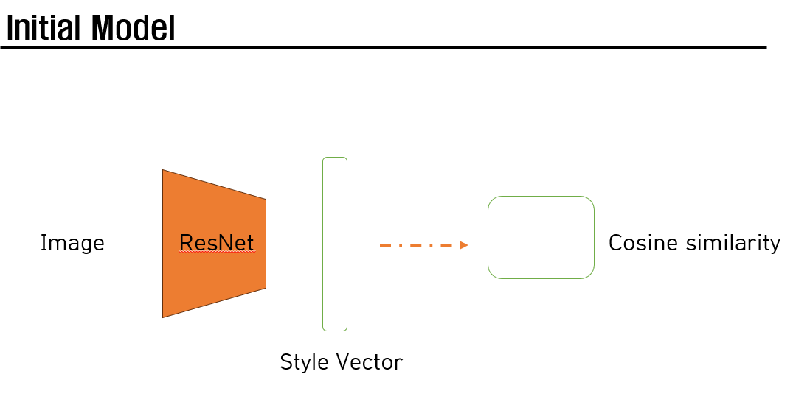

# Style Similarity Model 구축
본 프로젝트에서 하고자 하는 목표는 style 간의 유사도를 측정하는 것이다. 즉, style feature의 새로운 평가 지표를 제안.
이미지를 input으로 받은 model이 style information이 담긴 style vector/feature map을 뽑아내는 것을 기대.
해당 style vector/feature map으로 classification & distance loss 를 통해 style 간의 유사도를 측정하고자 함.

- Dataset 
Kaggle의 WikiArt에서 약 100,000장의 이미지를 제공 for 33 styles.

## First experiment 
cosine similarity를 loss fucntion으로 같은 style이면 유사도가 높게, 다른 style이면 유사도가 낮게 학습

### problem
이 경우, positive pair의 부족(Server 상의 GPU 한계) & cosine similarity로 미는 척도(유사한 style이면 조금 밀고, 관련 없는 style이면 많이 밀어내는)를 정할 수 없는 문제로 인해서 실패
[모델사진]

## Second experiment
그럼, classification은 잘 되나 실험해 봤는데 test accuary가 10% 였다. 즉, 아무런 근거 없이 classificaiton을 하는 것은 style information을 뽑아내지 못한다. 

그럼에도, 최대한 성능을 끌어내고자 다양한 실험을 거쳤고 최종적으로 efficientNet을 사용하여 test accuary 50%를 달성했다.

## Third experiment
classification만으론 model이 온전한 style info를 뽑아낸다는 근거가 부족하다.

style information을 온전히 뽑아내기 위해, 구도가 같지만 style이 다른 이미지를 이용하여 style info를 뽑아내고자 했다. (image + style = style image)

* reference paper
- Neural Style Transfer
- Pix2Pix
- Control-Net
- InstructPix2Pix
- GAN
- UNet
- Conditioning GAN
- Diffusion
- DreamBooth
- CLIP
- WikiArt
- StyleGAN
- Prompt-to-prompt
- AdaIN
- Etc.

(1) Pix2Pix paper implementation
Pix2Pix에서 제안하는 method를 그대로 사용했다. 색깔의 변화만 존재
[모델사진]
[결과사진]

(2) +UNet
Generator architecture를 UNet으로 바꿨다. 색깔의 변화만 존재
[모델사진]
[결과사진]

(3) +reference image 
UNet decoder 단에 style reference image를 VGG network를 통해 전달함으로써, style info를 뽑는 동시에 정보 전달을 하려고 노력함. 

    1) 정답 이미지(style image)를 reference image로 주었을 때, 완벽히 따라하는 걸 보고 가능성이 있다고 판단
    2) 같은 style의 다른 구도 이미지를 제공. 즉, reference image 1장. generator가 학습을 포기
    3) 같은 style의 다른 구도 이미지를 제공. 이때, reference image는 3장. 색깔 변화 + object 생성의 시작.
    4) 같은 style의 다른 구도 이미지를 제공. 이때, reference image는 5장. 확연한 변화가 눈에 보인다.
[모델사진]
[결과사진]

### Problem
많은 노력을 했음에도 불구하고, 여전히 생성된 이미지에 noise가 심하다.

Style의 범주가 워낙 크다보니, 작은 모델 & 적은 데이터 셋으로 학습하기가 매우 어렵다

### Solution
Style의 범주를 사람에 대한 style로 좁혀서 정의한다. 사람과 관련된 prompt로 다시 데이터셋 구성(대략 2000장)

## Fourth experiment
reference image 5장 (같은 style의 다른 구도 이미지)를 제공했다. Style의 범주를 좁혀서 학습하니, 성능이 나오는 걸 확인.

### Problem
    (1) 이미지가 여전히 blurry하다. 
    (2) Discriminator가 classification할 때의 근거가 부족하다.
    (3) 이미지가 정확히 같은 구도는 아니다.
        - 없던 object가 생기거나
        - 모양이 바뀌거나 etc.

#### Upon in the future
만일, 학습이 잘 되었다면 이후에 할 step은 reference image를 generator decoder에 줄 때 사용한 feature map/vector로 classification 및 distance loss를 주어 학습을 시키는 것이다. 

그렇게 하면, style information으로 classification을 하는 동시에 같은 class면 두 vector가 같은 분포를 가지도록 학습이 되기 때문에, 추후에 분포상 거리에 따라 style similarity를 측정할 수 있게 된다.

#### 추가적인 개선사항
- StyleGAN2에서 style을 주입하는 방식
- Model 구조
- Dataset 
- GAN에서 사용하는 regularization loss
- 512x512 image로 upscaling

#### Problem
이 새로운 평가지표가, 기존에 존재하는 FID & KID 등 과의 차별점이 존재하는가?
적은 이미지로도 측정 가능하지만, 엄청나게 많은 style을 학습시켜야 하기 때문에 cost가 비싸다.